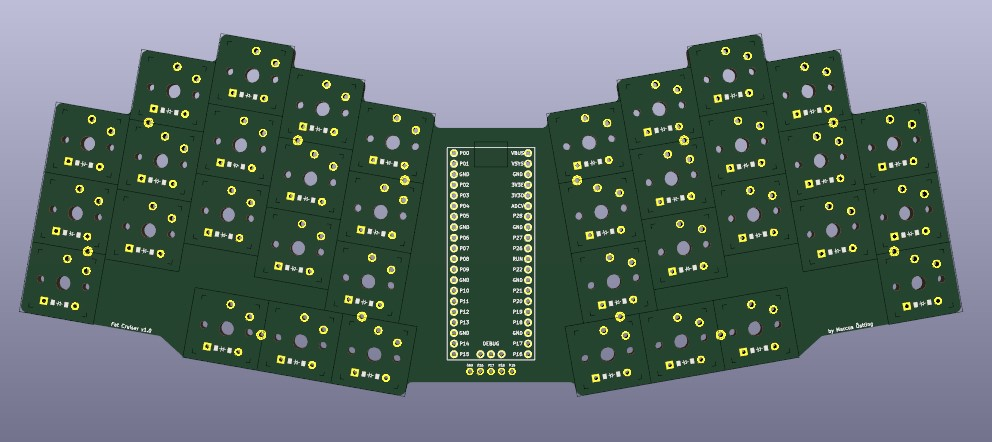
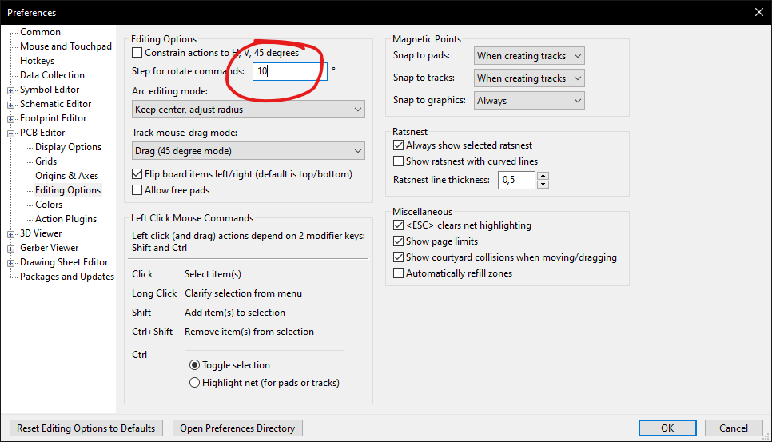

# Keyboards

<div align="center">

Collection of my keyboards and keymaps.



[Keyboards](#keyboards-keyboard) •
[Dependencies](#dependencies-package) •
[Related Projects](#related-projects-link)

</div>

## Keyboards :keyboard:

#### Fat cruiser

* [v1](./fat_cruiser/v1/README.md)
  <details>
  <summary>Preview</summary>

  

  </details>

## Dependencies :package:

* [KiCad](https://www.kicad.org/)
* [Ergogen](https://github.com/ergogen/ergogen)
  * Install with `npm install -g ergogen`

## Miscellanceous :sparkles:

### Vim magic

Useful find and replace to add a value to all the coordinates in a KiCad file.

```Vim
:'<,'>s/-*\d\+\.\d\+/\=str2float(submatch(0))+13.97/`
```

### KiCad Preferences

Set the rotation step to the same value as your keyboard's rotation.



## Related Projects :link:

* <https://github.com/benvallack/ergogen>
