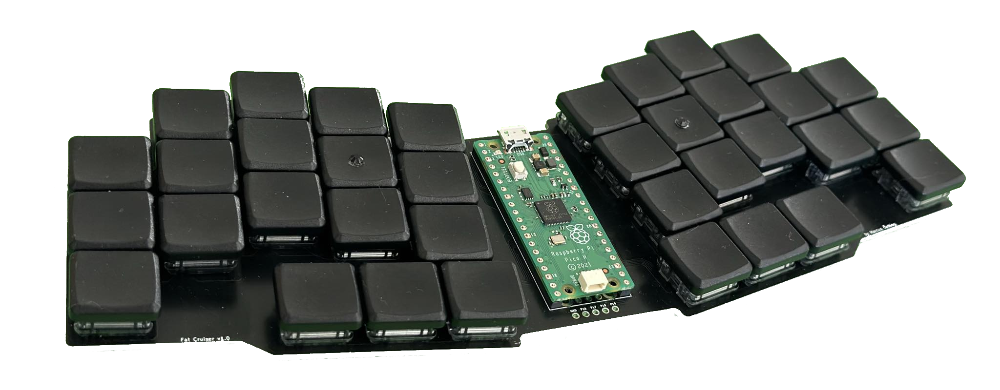
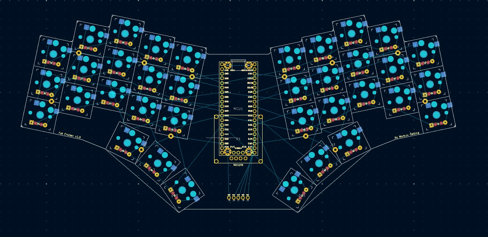

# Keyboards

<div align="center">

Collection of my keyboards and keymaps.


[Keyboards](#keyboards-keyboard) •
[Dependencies](#dependencies-package) •
[Related Projects](#related-projects-link)

</div>

## Keyboards :keyboard:

#### Fat cruiser

* [v1](./fat_cruiser/v1/README.md)
  <details>
  <summary>Preview</summary>

  

  </details>
* [v2](./fat_cruiser/v2/README.md)
  <details>
  <summary>Preview</summary>

  

  </details>

## Dependencies :package:

* [KiCad](https://www.kicad.org/)
* [Ergogen](https://github.com/ergogen/ergogen)
  * Install with `npm install -g ergogen`
* [QMK](https://qmk.fm/)
  * Clone or fork the [QMK repository](https://github.com/qmk/qmk.fm)
  * Optional: [Bear](https://github.com/rizsotto/Bear)
    * sudo apt-get install bear
    * bear -- make <keyboard>:<keymap>

## Miscellanceous :sparkles:

### Vim magic

Useful find and replace to add a value to all the coordinates in a KiCad file.

```Vim
:'<,'>s/-*\d\+\.\d\+/\=str2float(submatch(0))+13.97/`
```

### KiCad tips

* Set rotation step to match your keyboard for easier rotation of components
  * See below
* Tools -> Clean up tracks and vias
* Edit -> Edit teardrops
  * Add teardrops to pads for stronger connections to tracks
* Route -> Design Rules Checker
  * Check for errors in your PCB design

#### KiCad Preferences

Set the rotation step to the same value as your keyboard's rotation.


## Related Projects :link:

* <https://github.com/benvallack/ergogen>
