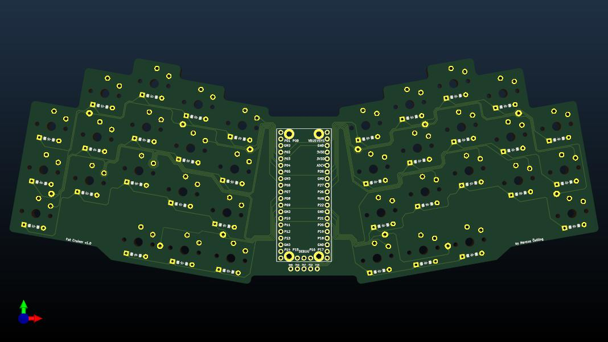

# Template

<div align="center">

Template is repository template.



[](https://github.com/mackeper/SeshMgr.nvim/actions/workflows/docs.yml)
[](https://github.com/mackeper/SeshMgr.nvim/actions/workflows/tests.yml)

[Introduction](#introduction-wave) •
[Features](#features-sparkles) •
[Installation](#installation-package) •
[Configuration](#configuration-gear) •
[Contributing](#contributing-tada) •
[Related Projects](#related-projects-link)

</div>

## Introduction :wave:

Some intruduction text.

## Features :sparkles:

Overview of the features.

### Feature 1 :keyboard:

| Command | Description |
:-------------------------:|:-------------------------:
Command 1 | Description 1
Command 2 | Description 2

### Feature 2 :telescope:

- `item 1` - Description 1
- `item 2` - Description 2
- `item 3` - Description 3

## Installation :package:

<details>
<summary>With some package manager</summary>

```bash
sudo apt install <package>
```

</details>

## Configuration :gear:

<details>
<summary>Example</summary>

```bash
example
```

</details>

### Default configuration

```bash
default
```

## Contributing :tada:

See [CONTRIBUTING.md](./CONTRIBUTING.md)

## Related Projects :link:

- Project 1
