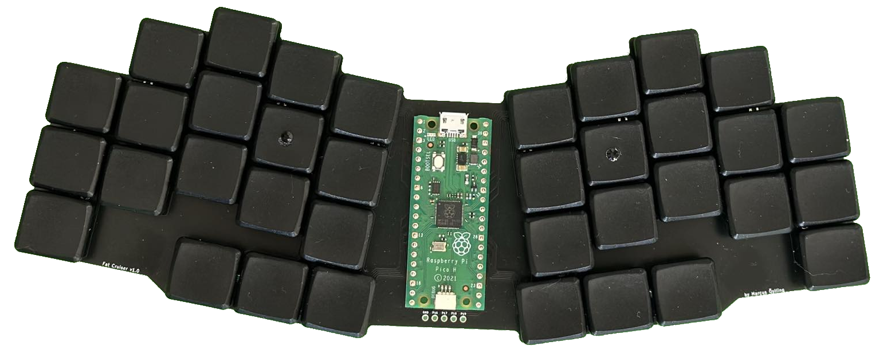
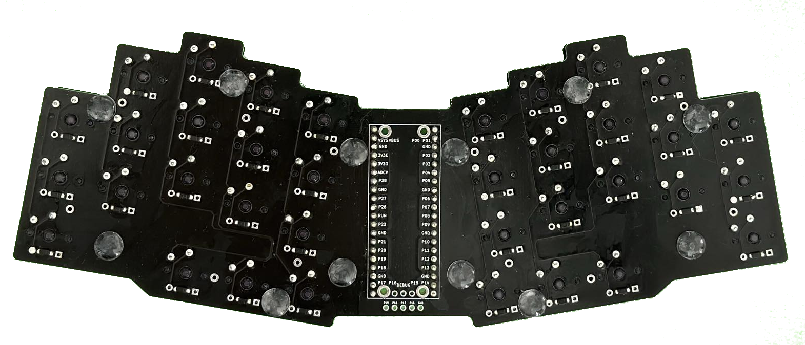
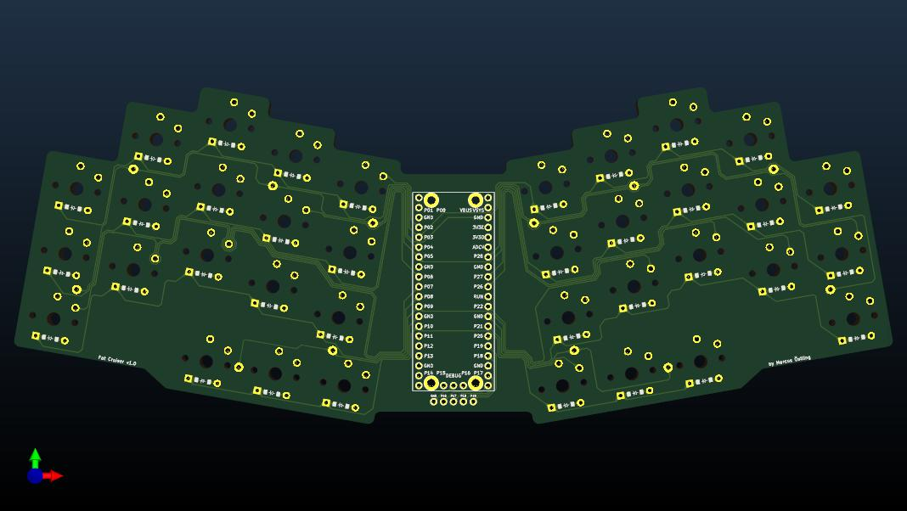

# Fat Cruiser v1

See [keymap layout](./qmk/readme.md).

### Images :camera:

  
Click to expand

  

    
    
    
  

### Build :hammer:

From within `fat_cruiser/v1/`:

- `ergogen .`

### Parts :nut_and_bolt:

| Part                                                    | Price                  | Url                                                                                                                        |
|----------------                                         | ---------------        | ---------------                                                                                                            |
| PCB                                                     | €10.58 ( + €24.76 )    | [jlcpcb](https://jlcpcb.com/)                                                                                              |
| 40 Switches (Kalih choc purple)                         | €19.80                 | [splitkb](https://splitkb.com/products/kailh-low-profile-choc-switches?variant=47265452458331)                             |
| 40 Keycaps (Blank MBK Choc u1)                          | €16.36                 | [splitkb](https://splitkb.com/products/blank-mbk-choc-low-profile-keycaps?variant=31811491987533)                          |
| 100 SMT Diodes                                          | €2.49                  | [splitkb](https://splitkb.com/products/smd-diodes?variant=42283984027907)                                                  |
| Raspberry Pi Pico H                                     | €5.89                  | [elektrokit](https://www.electrokit.com/en/raspberry-pi-pico-h)                                                            |
| Total                                                   | €55.12                 |                                                                                                                            |
