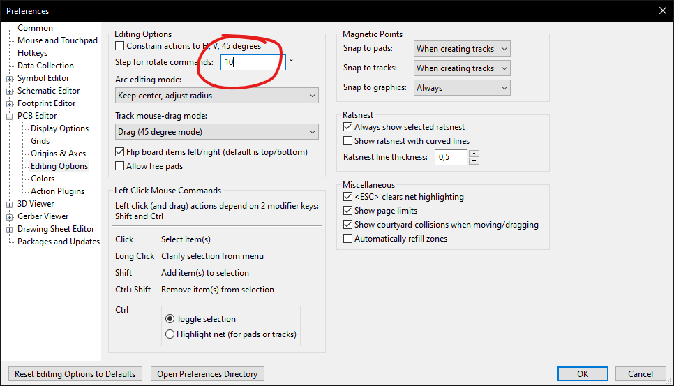

# Title

Some description

## Development :sparkles:

### Prerequisites :clipboard:

- `npm install -g ergogen`

### Build :hammer:

From within `first/`:

- `ergogen .`

## Vim magic :sparkles:

- `:'<,'>s#-*\d\+\.\d\+#\=str2float(submatch(0))+13.97#`

## KiCad Preferences :wrench:

Set the rotation step to be equal to the rotation of the keyboard. This will make it easier to route.

`Preferences` -> `Preferences` -> `PCB Editor` -> `Editing Options` -> `Step for rotate commands` -> `10`

