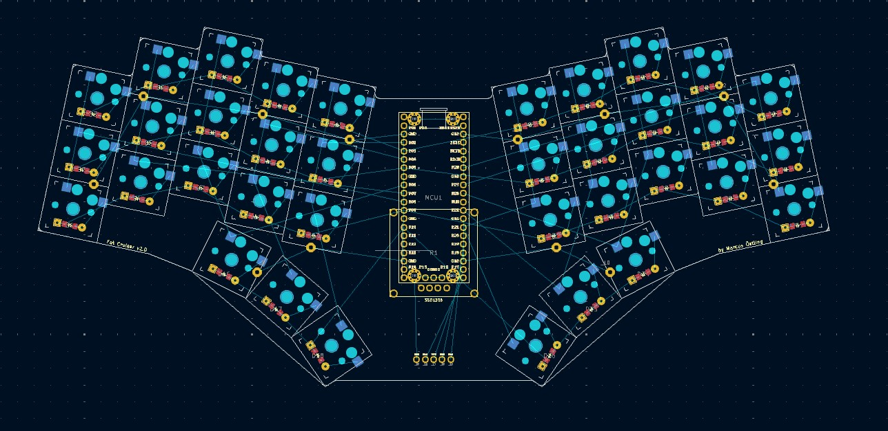

# Fat Cruiser v2

<!--  -->

See [keymap layout](./qmk/readme.md).

### Images :camera:

  
Click to expand

  

    
  

### Changes from v1:
  - Design
    - Increate rotation from 10° to 12°
    - A bit less staggered
      - v1: 0, 16, 7, -5, -5
      - v2: 0, 12, 7, -5, -2
    - Add angle and splay to thumb cluster
      - The thumb should now rest at the center key
  - Hardware
    - Switch to nice!nano v2 (from Raspberry Pi Pico H)
      - Add sockets for MCU
    - Move the diodes to front, inbetween the switches
    - Change switches to Kalih choc redpro (from Kalih choc purple)
      - Hot swappable
    - Change keycaps to MoErgo POM MCC-Profile 1U Keycap (from blank MBK Choc U1)

### Dependencies :gear:

- [KiCad](https://www.kicad.org/)
- [QMK](https://qmk.fm/)
- [Ergogen](https://github.com/berigora/ergogen)
    - `npm install -g ergogen`
- [jscad](https://github.com/jscad/OpenJSCAD.org)
    - `npm install -g @jscad/cli` (this does not work with ergogen generated jscad files yet)
    - `npm install -g @jscad/openjscad` (old version, but works with ergogen generated jscad files)

### Build :hammer:

From within `fat_cruiser/v2/`:

- `ergogen . && for i in output/cases/*.jscad; do npx @jscad/cli@1 "$i" -of stla; done`

### KiCad plot pcb :printer:

- Open pcb in KiCad
- File -> Page Settings
    - Set to A4
- File -> Plot
  - Plot format: PDF
  - Include layers:
    - F.Cu
  - Plot on all layers:
    - F.Cu
    - B.Cu
    - F.Fab
    - B.Fab
    - F.SilkS
    - F.Mask
    - B.Mask
    - Edge.Cuts
    - User.Drawings
    - User.Comments
    - F.Courtyard
    - B.Courtyard
  - Plot drawing sheet
  - Drill marks
    - Actual size
  - Sketch pads on fabrication layers
  - Select output directory

### Parts :nut_and_bolt:

| Part                                          | Price               | Url                                                                                                                     |
| ----------------                              | ---------------     | ---------------                                                                                                         |
| PCB                                           | €10.58 ( + €24.76 ) | [jlcpcb](https://jlcpcb.com/)                                                                                           |
| 40 Switches (Kalih choc redpro)               | €23.96              | [splitkb](https://splitkb.com/products/kailh-low-profile-choc-switches?variant=33100108234829)                          |
| 40 Keycaps (MoErgo POM MCC-Profile 1U Keycap) | €19.96              | [splitkb](https://splitkb.com/products/moergo-mcc-profile-1u-keycap?_pos=3&_sid=99ef29720&_ss=r&variant=42898211602691) |
| 100 SMD Diodes                                | €2.49               | [splitkb](https://splitkb.com/products/kailh-hotswap-sockets?_pos=1&_sid=9303a7619&_ss=r)                               |
| nice!nano v2                                  | €25.94              | [splitkb](https://splitkb.com/products/nice-nano?_pos=1&_sid=33e2bd019&_ss=r)                                           |
| SSD1306 OLED Display                          | €5.89               | [splitkb](https://splitkb.com/products/oled-display?_pos=1&_sid=de7400663&_ss=r&variant=31226608549965)                 |
| Kailh Hotswap Sockets                         | €7.95               | [splitkb](https://splitkb.com/products/kailh-hotswap-sockets?_pos=1&_sid=9303a7619&_ss=r)                               |
| Battery 110 mah                               |                     |                                                                                                                         |
| Connector                                     |                     |                                                                                                                         |
| Power switch                                  |                     |                                                                                                                         |
| Mill Max Low Profile Sockets                  | €11.45              | [splitkb](https://splitkb.com/products/mill-max-low-profile-sockets?variant=47060695646555)                             |
| Total                                         | €55.12              |                                                                                                                         |
